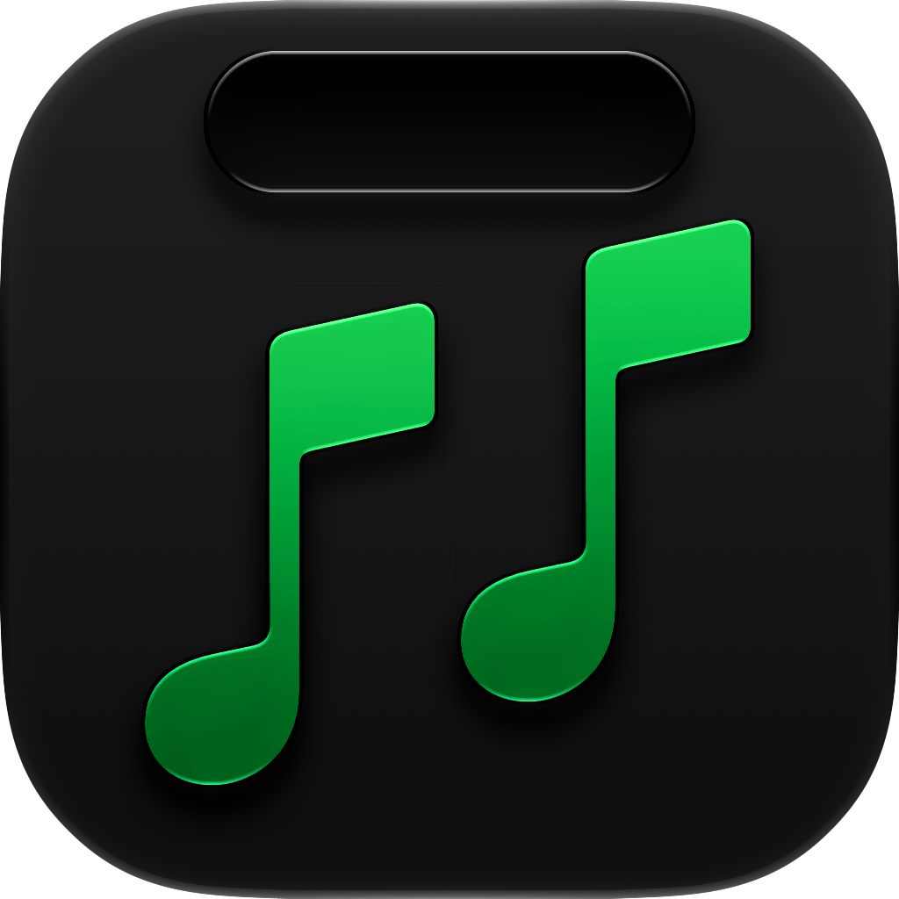
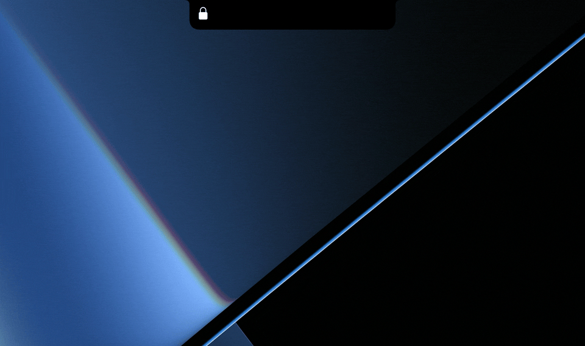

<div align="center">
  <a href="https://github.com/Noah-Johann/MusicNotch/releases/latest/download/MusicNotch.dmg">
    
  </a>

  <h1 align="center">MusicNotch</h1>
  <p align="center">Make your notch do so many things</p>
</div>

<br/>

<p align="center">
  
</p>

<br/>

<!--
## Table of Contents

*   [Download](#download)
*   [Localization](#localization)
*   [License](#license)
*   [Acknowledgments](#acknowledgments)
-->

## Features
MusicNotch turns your MacBook's notch from just a cutout in your screen into a dynamic information center complete with music controls. Control your **Spotify** playback easily with a hover of the notch instead of opening a separate app. Get information about battery status, volume, brightness and more.  

> [!NOTE]
> MusicNotch currently works with Apple Music and the official Spotify client. A system-wide now playing integration will be added soon.


### Roadmap
For details about upcoming and planned features, check out the [Roadmap](https://github.com/users/Noah-Johann/projects/1)

## Download

> [!WARNING]
> Since I dont have an Apple Developer Account, the app will show a popup on the first launch saying that the app couldn't be verified. To launch the app:
> 
> 1.  Click **OK** to close the popup
> 2.  Open **Settings** -> **Privacy & Security**
> 3.  Scroll down until you see **MusicNotch**
> 4.  Click **Run anyway**
> 
> You only have to do this on the first launch of the App


### Direct Download

See [Releases](https://github.com/Noah-Johann/MusicNotch/releases) for the latest version.


### Download via Homebrew

To download the app using [Homebrew](https://brew.sh), run the following command in your terminal:

```bash
brew install --cask Noah-Johann/MusicNotch/MusicNotch --no-quarantine
```

### Updates

MusicNotch automatically checks for updates in the background and notifies you when a new version is available. You can also check for updates manually at any time.

Since MusicNotch uses the Sparkle framework, updating through apps like [Latest](https://github.com/mangerlahn/Latest) is also supported.

### System Requirements
- **macOS 14 Sonoma or later**
- MusicNotch works on Macs with and without a notch


## Localization
MusicNotch is currently localized in the following languages:
* English
* German

  
## License
MusicNotch is licensed under the GNU General Public License v3.0. See [`LICENSE`](/LICENSE) for more details.

## Acknowledgments
To view acknowledgments, see [`Acknowledgments.md`](/Acknowledgments.md).
